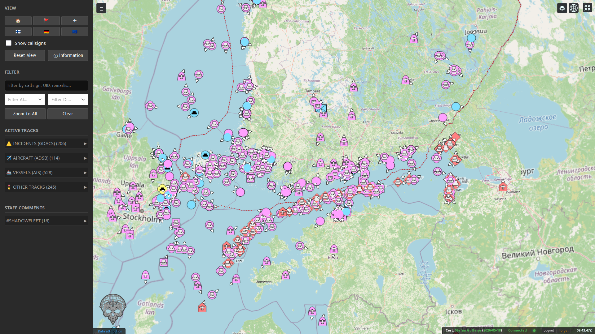
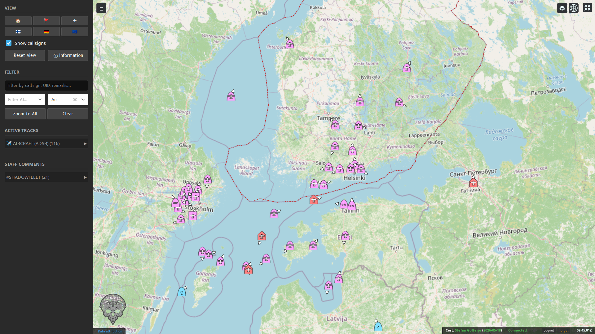
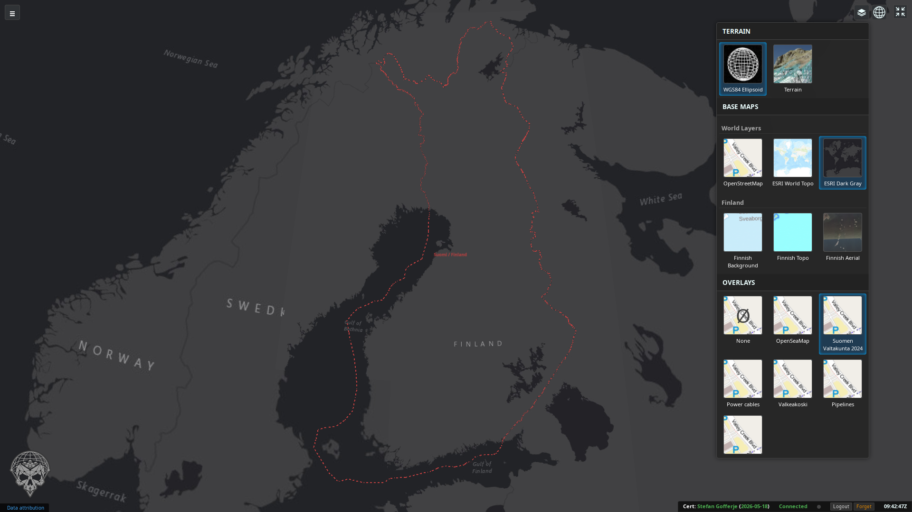
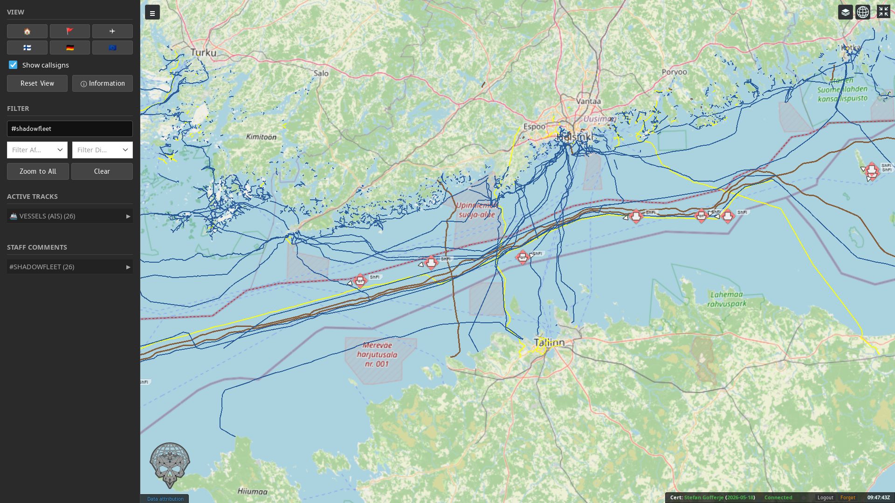
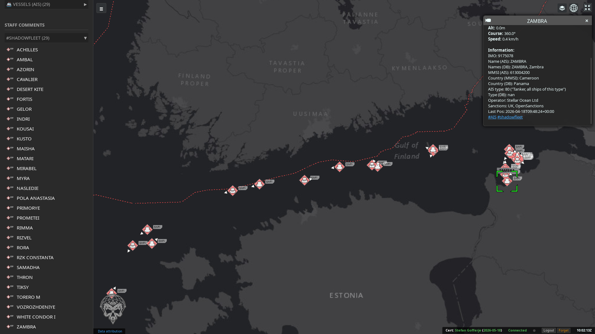
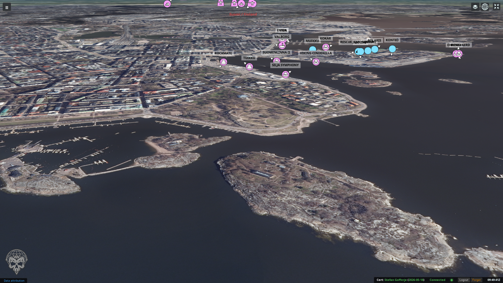
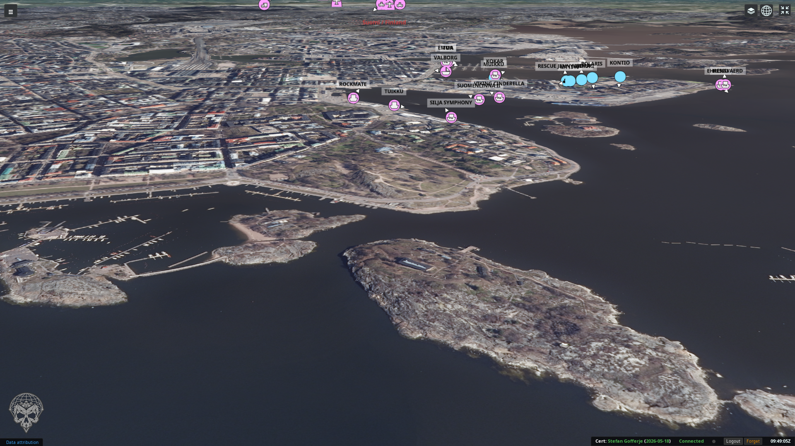

# tak-webview-cesium
A unified web application for visualizing Cursor-on-Target (CoT) data from a TAK Server using CesiumJS.

(C) 2026 Stefan Gofferje

Licensed under the GNU General Public License V3 or later.

## Description
This application provides a real-time 3D tactical view of Cursor-on-Target (CoT) data from a TAK Server. It's built as a lightweight, web-based tool for situational awareness, focusing on high-performance rendering and ease of use. It's an open-source project created by a TAK user for the community.

### Key Features
- **Flexible Authentication:**
    - **Automated Enrollment:** Securely obtain certificates directly from your TAK Server (port 8446).
    - **Manual Certificate Upload:** Support for importing existing `.p12`/`.pfx` certificates.
- **Privacy & Security:** Ephemeral session storage for certificates and credentials. No data is stored permanently on disk in unencrypted form.
- **Status Tray:** Real-time feedback on connection status, certificate expiry, and identity.
- **Advanced Visualization:** 
    - **3D Environment:** Powered by CesiumJS for a global, high-fidelity view.
    - **MIL-STD-2525 Support:** Military symbols rendered efficiently using `milsymbol`.
    - **Staff Comments:** Highlighting of specific patterns in staff comments (e.g., callsigns or status codes).
- **Intelligent Controls:** 
    - **Quick Navigation:** Configurable "Goto" buttons for points of interest.
    - **Zoom to All:** Automatically fits the view to all active entities.
    - **Callsign Management:** Toggleable labels with automatic visibility for selected units.
- **Layer & Overlay Support:**
    - **Custom Map Sources:** Support for WMS, XYZ/TMS, and ArcGIS MapServer.
    - **Local Overlays:** Automatic loading of GeoJSON, KML, and CZML files from a local directory.
    - **Polygon Labeling:** Automatic geographic centering and labeling of polygon features.
- **Performance:** Optimized communication using MessagePack and configurable update throttling.
- **Internationalization:** Interface available in English, German, Finnish, and Swedish.
- **Custom Branding:** Ability to set a custom application title and display a logo on both the map and the login screen.

## Custom Layers & Overlays

### Web Map Sources (`customlayers.json`)
You can configure external map sources in `customlayers.json`. Layers can be categorized and marked as overlays for simultaneous display.

```json
[
  {
    "name": "Finnish Topo",
    "type": "wms",
    "url": "https://tiles.kartat.kapsi.fi/peruskartta?",
    "layers": "peruskartta",
    "attribution": "Maanmittauslaitos",
    "category": "Finland"
  },
  {
    "name": "OpenSeaMap",
    "type": "xyz",
    "url": "https://tiles.openseamap.org/seamark/{z}/{x}/{y}.png",
    "attribution": "OpenSeaMap",
    "category": "Overlays",
    "is_overlay": true
  }
]
```

### Local File Overlays
Place your `.geojson`, `.kml`, or `.czml` files in the `/app/overlays` directory (usually via a Docker volume bind). The application will automatically scan this directory and add them to the "Local Files" category in the layer switcher.

## Security Model
The application is designed with a "Never-Unencrypted-on-Disk" philosophy:

- **Transparent Encryption:** Private keys are encrypted using AES-128-CBC (Fernet) with keys derived from your session credentials.
- **RAM-Only Decryption:** Keys are decrypted directly into memory (using Linux `memfd` where available) when connecting to the TAK Server.
- **Ephemeral Storage:** All session data is automatically wiped upon logout, after three failed login attempts, or when the certificate expires.

**Note:** For production use, always run this application behind a reverse proxy (like Nginx or Traefik) to provide HTTPS transport security.

## Configuration
Configuration is handled via environment variables or an `.env` file.

| Variable              | Default          | Purpose                                                                                |
| --------------------- | ---------------- | -------------------------------------------------------------------------------------- |
| `APP_TITLE`           | `TAK Cesium Map` | Title displayed in the browser tab and header                                          |
| `TAK_HOST`            | `localhost`      | Hostname or IP of the TAK Server                                                       |
| `TAK_PORT`            | `8089`           | TLS port of the TAK Server                                                             |
| `TAK_ENROLL_PORT`     | `8446`           | Enrollment port (for automated certificate setup)                                      |
| `TAK_CALLSIGN`        | `CesiumViewer`   | Callsign for this viewer instance                                                      |
| `TAK_TYPE`            | `a-f-G-U-C-I`    | CoT type for the viewer entity                                                         |
| `TAK_UID`             | (Generated)      | Unique ID for the viewer (defaults to `CesiumViewer-[Callsign]`)                       |
| `TAK_STAFF_COMMENTS`  | (Empty)          | Comma-separated map for highlighting staff comments (e.g., `#SF=ShadowFleet,#LEO=LEO`) |
| `GOTO_BUTTONS`        | (Empty)          | Quick-jump buttons: `Label:Lat,Lon,Zoom;...`                                           |
| `SECRET_KEY`          | (Random)         | Key for signing session cookies (regenerated on restart)                               |
| `WS_THROTTLE`         | `0.5`            | Minimum seconds between updates per entity (throttles frontend traffic)                |
| `USE_MSGPACK`         | `true`           | Use MessagePack for binary WebSocket communication                                     |
| `CENTER_ALERT`        | `false`          | Automatically center the map on new emergency/alert messages                           |
| `LOGO`                | (Empty)          | Path to a custom logo file inside the container                                        |
| `LOGO_POSITION`       | `bottom_right`   | Map logo position: `top_left`, `top_center`, `top_right`, etc.                         |
| `CESIUM_ION_TOKEN`    | (Empty)          | Cesium Ion token for Bing Maps and global terrain                                      |
| `TERRAIN_URL`         | (Empty)          | URL to a Cesium terrain provider                                                       |
| `INITIAL_LAT` / `LON` | Helsinki         | Initial map center coordinates                                                         |
| `TRUSTED_PROXIES`     | `127.0.0.1`      | IPs to trust for `X-Forwarded-For` headers                                             |

## Quick Start (Docker Compose)

```yaml
services:
  tak-webview:
    image: ghcr.io/sgofferj/tak-webview-cesium:latest
    ports:
      - "8000:8000"
    volumes:
      - ./customlayers.json:/app/customlayers.json:ro
      - ./overlays:/app/overlays:ro
      - ./user_iconsets:/app/user_iconsets:ro
    environment:
      - TAK_HOST=your.takserver.com
      - GOTO_BUTTONS=Helsinki:60.16,24.93,5000;Tampa:27.95,-82.45,10000
      - TAK_STAFF_COMMENTS=#SF=ShadowFleet
    restart: unless-stopped
```

## Support
If you find a bug or have a suggestion, feel free to open an issue or submit a pull request. This is a community effort!

## Frontend Usage Hints

Here are some tips for using the frontend that might not be immediately obvious:

-   **Overlay Styling:** To change the display style of a local file overlay (GeoJSON, KML, CZML), **right-click** on its entry in the "Layers" panel. This opens a modal to customize its color, line width, and other properties.
-   **Smart Selection:** Clicking on an entity's trail or course/speed vector arrow will automatically select the entity itself, making it easier to interact with moving units.
-   **Hashtag Filtering:** In an entity's info box, any text that looks like a hashtag (e.g., `#incident-alpha`) becomes a clickable link. Clicking it will automatically filter the view to show only entities with that same tag.
-   **"Zoom to All" Logic:** This button intelligently zooms to fit all *filtered* entities. It also automatically excludes extreme outliers to prevent zooming out to a global view unnecessarily.
-   **"Reset View" Button:** This button does two things: it resets the camera to a top-down, North-up orientation, and its icon changes to indicate whether the current view is tilted or top-down.
-   **Session Persistence:** The application automatically saves your view (camera position, filters, selected layers) to your browser's local storage. When you reload the page, your session will be restored exactly where you left off.

## Examples

### Normal view



### Filter (Air dimension)



### Polygon overlay (Finnish borders)



### Polyline overlays (Baltic Sea infrastructure)



### Staff comments (TAK_STAFF_COMMENTS="#shadowfleet=ShFl")



### Custom map layer (Finnish Landsurvey Orthophoto)



### Custom map layer with elevation data (Cesium quantized mesh tiles from Finnish Landsurvey 2m resolution LIDAR data)


