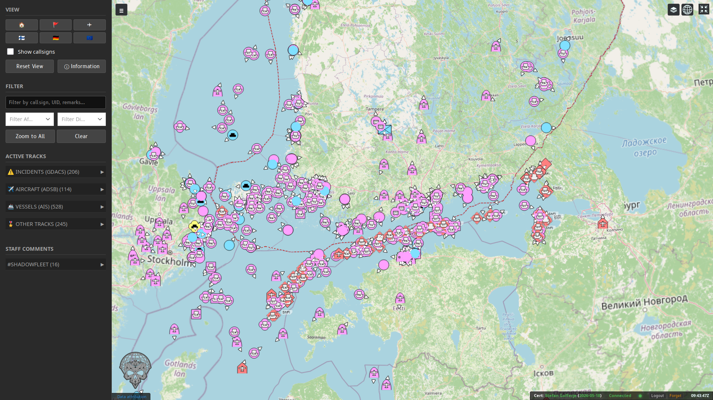
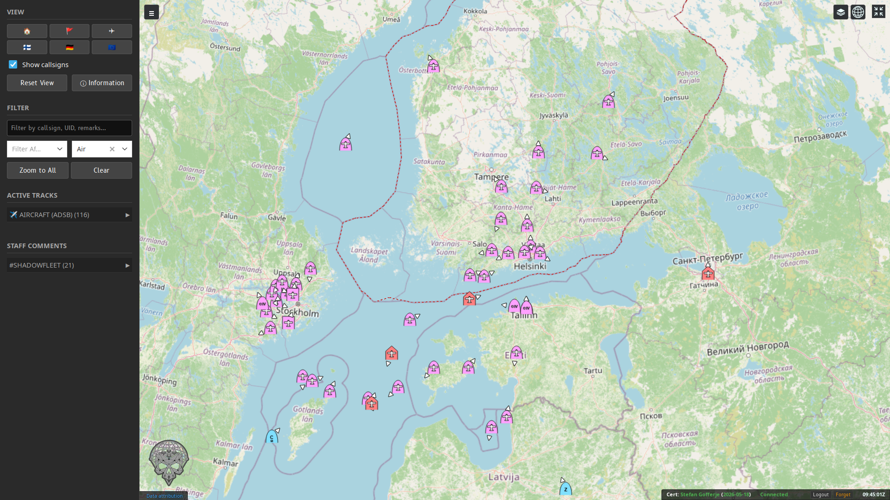
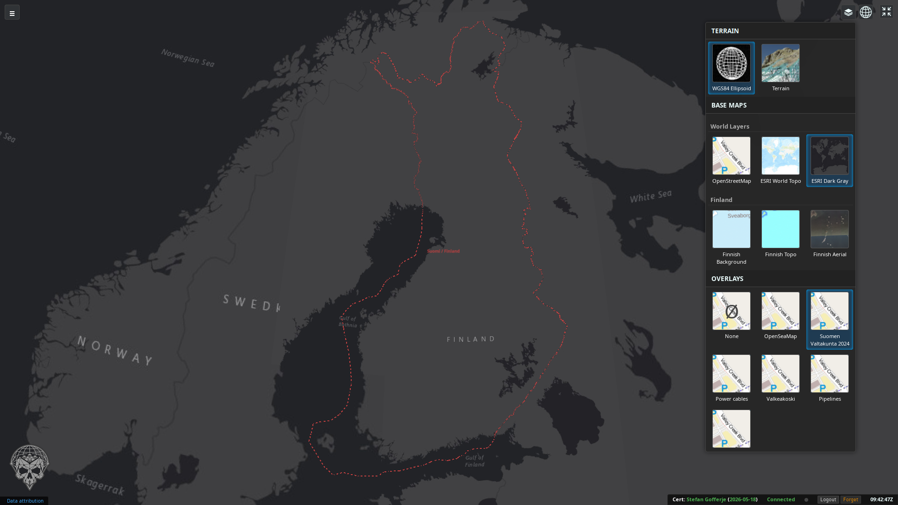
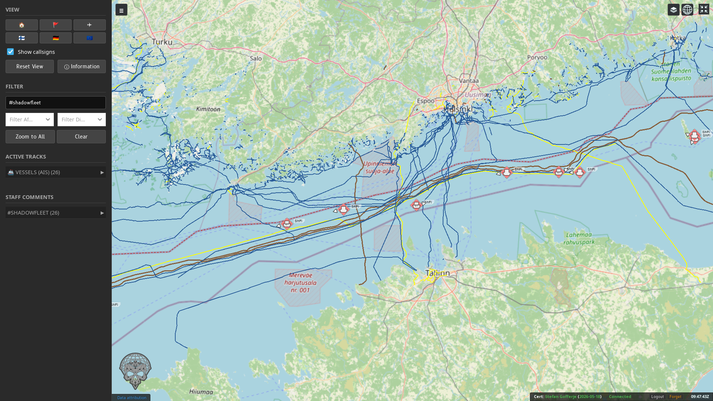
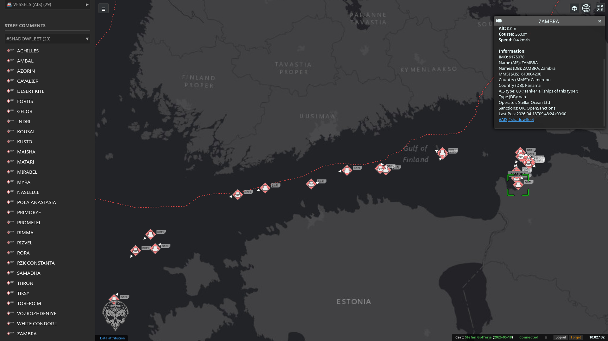
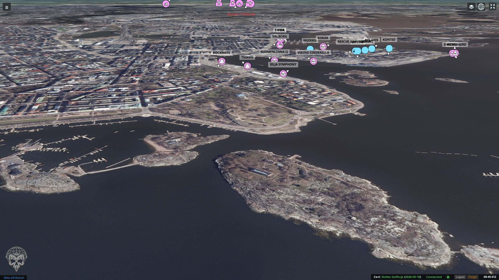
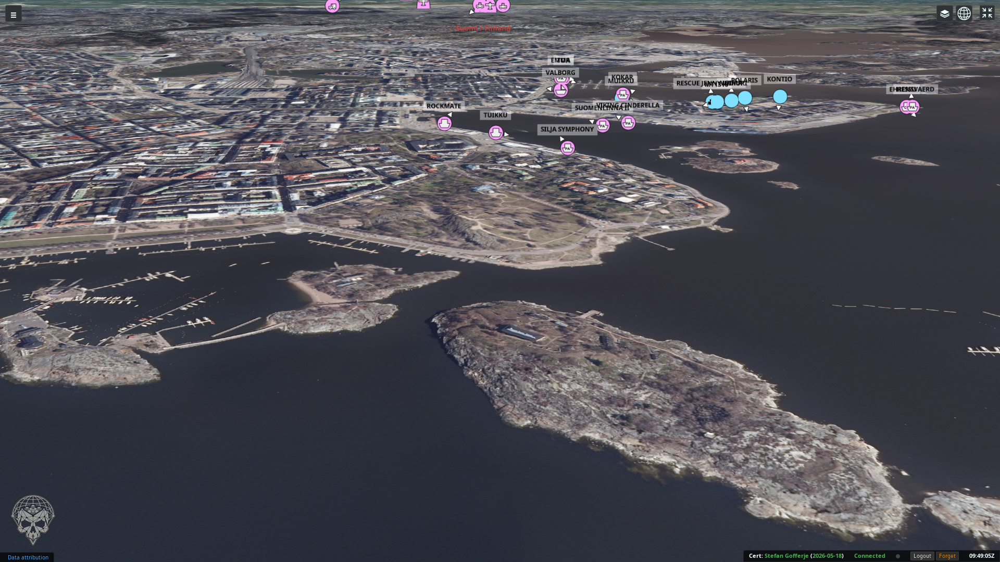

# tak-webview-cesium
A unified web application for visualizing Cursor-on-Target (CoT) data from a TAK Server using CesiumJS.

(C) 2026 Stefan Gofferje

Licensed under the GNU General Public License V3 or later.

## Description
This application provides a real-time 3D tactical view of Cursor-on-Target (CoT) data from a TAK Server. It's built as a lightweight, web-based tool for situational awareness, focusing on high-performance rendering and ease of use. It's an open-source project created by a TAK user for the community.

### Key Features
- **Flexible Authentication:**
    - **Automated Enrollment:** Securely obtain certificates directly from your TAK Server (port 8446).
    - **Manual Certificate Upload:** Support for importing existing `.p12`/`.pfx` certificates.
- **Privacy & Security:** Ephemeral session storage for certificates and credentials. No data is stored permanently on disk in unencrypted form.
- **Multi-User (Single Server):** Register any number of users against the same TAK Server on one install. Every user gets their own certificate, credentials, distinct per-user UID and fully isolated data; logging out wipes only that user's data.
- **Status Tray:** Real-time feedback on connection status, certificate expiry, and identity.
- **Channel Selection:** Status-bar "Channels" popup to subscribe/unsubscribe TAK Server groups (channels) via the Marti REST API; one checkbox per channel covers both IN and OUT directions.
- **Advanced Visualization:** 
    - **3D Environment:** Powered by CesiumJS for a global, high-fidelity view.
    - **MIL-STD-2525 Support:** Military symbols rendered efficiently using `milsymbol`.
    - **Staff Comments:** Highlighting of specific patterns in staff comments (e.g., callsigns or status codes).
- **Intelligent Controls:** 
    - **Quick Navigation:** Configurable "Goto" buttons for points of interest.
    - **Zoom to All:** Automatically fits the view to all active entities.
    - **Callsign Management:** Toggleable labels with automatic visibility for selected units.
- **Layer & Overlay Support:**
    - **Custom Map Sources:** Support for WMS, XYZ/TMS, and ArcGIS MapServer.
    - **Local Overlays:** Automatic loading of GeoJSON, KML, and CZML files from a local directory.
    - **Polygon Labeling:** Automatic geographic centering and labeling of polygon features.
- **Performance:** Optimized communication using MessagePack and configurable update throttling.
- **Internationalization:** Interface available in English, German, Finnish, and Swedish.
- **Custom Branding:** Ability to set a custom application title and display a logo on both the map and the login screen.

## Custom Layers & Overlays

### Web Map Sources (`customlayers.json`)
You can configure external map sources in `customlayers.json`. Layers can be categorized and marked as overlays for simultaneous display.

```json
[
  {
    "name": "Finnish Topo",
    "type": "wms",
    "url": "https://tiles.kartat.kapsi.fi/peruskartta?",
    "layers": "peruskartta",
    "attribution": "Maanmittauslaitos",
    "category": "Finland"
  },
  {
    "name": "OpenSeaMap",
    "type": "xyz",
    "url": "https://tiles.openseamap.org/seamark/{z}/{x}/{y}.png",
    "attribution": "OpenSeaMap",
    "category": "Overlays",
    "is_overlay": true
  }
]
```

### Local File Overlays
Place your `.geojson`, `.kml`, or `.czml` files in the `/app/overlays` directory (usually via a Docker volume bind). The application will automatically scan this directory and add them to the "Local Files" category in the layer switcher.

## Security Model
The application is designed with a "Never-Unencrypted-on-Disk" philosophy:

- **Transparent Encryption:** Private keys are encrypted using AES-128-CBC (Fernet) with keys derived from your session credentials.
- **RAM-Only Decryption:** Keys are decrypted directly into memory (using Linux `memfd` where available) when connecting to the TAK Server.
- **Ephemeral Storage:** All session data is automatically wiped upon logout, after three failed login attempts, or when the certificate expires.

**Note:** For production use, always run this application behind a reverse proxy (like Nginx or Traefik) to provide HTTPS transport security.

## Multi-User Support (Single Server)

The application supports multiple users against a **single** TAK Server from one install:

- Each registered user gets their **own** certificate, storage key and TAK connection. Enrollment/upload and login are always scoped to exactly one user.
- Every user announces a **distinct per-user UID** (`CesiumViewer-<sha256(username) prefix>`), so all sessions are separately visible on the TAK network.
- Users are fully isolated: per-user accounts, per-user messaging config (callsign/color/role) and per-user chat state. Logout or forgetting an account wipes **only that user's** data, never anyone else's.
- Private keys are still decrypted **RAM-only** per session (Fernet + `memfd`); each user's storage key is derived from their own password.
- When `FORCE_SERVER` is set, the whole install is pinned to one TAK Server: the server is resolved automatically in the UI and enrollments/uploads for any other server are rejected backend-side.
- **Scope:** exactly one TAK Server at a time. Multiserver support (several distinct servers with per-server data scoping) is deliberately deferred — see `MULTIUSER_PLAN.md`.

## Configuration
Configuration is handled via environment variables or an `.env` file. This is the complete list of supported variables.

### Connection & Server

| Variable              | Default      | Purpose                                                                          |
| --------------------- | ------------ | -------------------------------------------------------------------------------- |
| `TAK_HOST`            | `localhost`  | Hostname or IP of the TAK Server                                                 |
| `TAK_PORT`            | `8089`       | TLS port of the TAK Server                                                       |
| `TAK_ENROLL_PORT`     | `8446`       | Enrollment port (for automated certificate setup)                                |
| `TAK_API_PORT`        | `8443`       | TLS port of the Marti REST API (channel/group subscription)                      |
| `TAK_TYPE`            | `a-f-G-U-C-I`| CoT type for the viewer entity                                                   |
| `FORCE_SERVER`        | (Empty)      | Pin the install to one TAK Server; resolved automatically in the UI, and enrollments/uploads for any other server are rejected backend-side |

### Identity & Messaging

| Variable              | Default            | Purpose                                                                                                                     |
| --------------------- | ------------------ | --------------------------------------------------------------------------------------------------------------------------- |
| `TAK_CALLSIGN`        | `CesiumViewer`     | Default callsign for a viewer instance                                                                                      |
| `TAK_CALLSIGN_INPUT`  | (Empty)            | Callsign override from the messaging config UI                                                                              |
| `TAK_COLOR`           | (Empty)            | Team color chosen in the config UI (one of the TAK colors; e.g. `Cyan`, `Red`, `Green`)                                     |
| `TAK_GROUP_COLOR`     | `Cyan`             | Fallback team color for the SA `__group` when the UI has set none                                                             |
| `TAK_ROLE`            | (Empty)            | Role chosen in the config UI (e.g. `Team Lead`, `Medic`, `Forward Observer`)                                                |
| `TAK_UID`             | (Generated)        | Fixed UID override. When unset, a distinct per-user UID (`CesiumViewer-<sha256(username) prefix>`) is derived from the username (hashed, never in cleartext) |

### Enrollment / Ephemeral Certificate Files

The ephemeral file *names* living under the fixed directory `/app/certs/ephemeral`:

| Variable            | Default     | Purpose                       |
| ------------------- | ----------- | ----------------------------- |
| `EPHEMERAL_CERT`    | `cert.pem`  | Ephemeral certificate file    |
| `EPHEMERAL_KEY`     | `cert.key`  | Ephemeral private key file    |
| `EPHEMERAL_CA`      | `ca.pem`    | Ephemeral CA chain file       |
| `EPHEMERAL_CREDS`   | `creds.json`| Ephemeral credentials file    |

### Security

| Variable           | Default        | Purpose                                                                                                       |
| ------------------ | -------------- | ------------------------------------------------------------------------------------------------------------- |
| `SECRET_KEY`       | (Random)       | Key for signing session cookies. Set a fixed value to keep sessions valid across container restarts           |
| `TRUSTED_PROXIES`  | `127.0.0.1`    | Comma-separated list (or JSON array) of proxy IPs trusted for `X-Forwarded-For`                                   |

### Map & UI

| Variable                | Default                    | Purpose                                                          |
| ----------------------- | -------------------------- | ---------------------------------------------------------------- |
| `INITIAL_LAT`           | `60.1699`                  | Initial map center latitude                                      |
| `INITIAL_LON`           | `24.9384`                  | Initial map center longitude                                     |
| `TERRAIN_URL`           | (Empty)                    | URL to a Cesium terrain provider                                 |
| `TERRAIN_EXAGGERATION`  | `1.0`                      | Terrain height exaggeration factor                               |
| `CESIUM_ION_TOKEN`      | (Empty)                    | Cesium Ion token for Bing Maps and global terrain                |
| `APP_TITLE`             | `TAK Cesium Map`           | Title displayed in the browser tab and header                    |
| `LOGO`                  | (Empty)                    | Path to a custom logo file inside the container                  |
| `LOGO_POSITION`         | `bottom_right`             | Logo position (`top_left`, `top_center`, `top_right`, ...)       |
| `GOTO_BUTTONS`          | (Empty)                    | Quick-jump buttons: `Label:Lat,Lon,Zoom;...`                     |
| `CENTER_ALERT`          | `false`                    | Automatically center the map on new emergency/alert messages     |

### Traffic, Chat & Logging

| Variable              | Default      | Purpose                                                                   |
| --------------------- | ------------ | ------------------------------------------------------------------------- |
| `WS_THROTTLE`         | `0.5`        | Minimum seconds between updates per entity (throttles frontend traffic)   |
| `USE_MSGPACK`         | `true`       | Use MessagePack for binary WebSocket communication                        |
| `TAK_STAFF_COMMENTS`  | (Empty)      | Comma-separated staff-comment highlight map (e.g. `#SF=ShadowFleet,#LEO=LEO`) |
| `LOG_COTS`            | `false`      | Log incoming/outgoing CoT traffic                                         |

### Server & Files

| Variable              | Default             | Purpose                                                          |
| --------------------- | ------------------- | ---------------------------------------------------------------- |
| `PORT`                | `8000`              | HTTP port the web application listens on                         |
| `LAYERS_CONFIG_FILE`  | `customlayers.json` | Filename of the custom web map-source JSON (in the working directory) |

### Fixed container paths
The following paths are fixed inside the container and **not** configurable via environment variables: `/app/overlays` (auto-loaded local GeoJSON/KML/CZML overlays), `/iconsets` (built-in MIL-STD-2525 iconsets), `/app/user_iconsets` (user-provided iconsets) and `/app/certs/ephemeral` (RAM-only decrypted ephemeral certs).

## Quick Start (Docker Compose)

```yaml
services:
  tak-webview:
    image: ghcr.io/sgofferj/tak-webview-cesium:latest
    ports:
      - "8000:8000"
    volumes:
      - ./customlayers.json:/app/customlayers.json:ro
      - ./overlays:/app/overlays:ro
      - ./user_iconsets:/app/user_iconsets:ro
    environment:
      - TAK_HOST=your.takserver.com
      - GOTO_BUTTONS=Helsinki:60.16,24.93,5000;Tampa:27.95,-82.45,10000
      - TAK_STAFF_COMMENTS=#SF=ShadowFleet
    restart: unless-stopped
```

## Changelog (2026-09-01)
- **Messaging config persistence:** Callsign/color/role now stored in `account.json` (per-user) in addition to RAM, so a container restart or re-login no longer loses the identity. `GET /api/messaging/config` falls back to disk and `POST` syncs both layers. Frontend now loads the config on startup (`startApp → loadMessagingConfig` before `startWebSocket`), correctly scopes `localStorage` per user (`getSelfInfoKey()`), migrates the legacy unscoped key, and pushes a locally-stored identity to the backend when the backend is empty. Status bar now shows `username - <callsign> (<role>)` immediately after login.
- **Channels 403 fix:** `GET /Marti/api/groups/user` is admin-only (403 for normal certs — verified live). Switched `get_group_entitlements` to `GET /Marti/api/groups/all?useCache=true&sendLatestSA=true` (the endpoint that works with a user cert), with deduplication by `(name, direction, created)` mirroring `python-takserver-api` and fallback to the old path. `PUT /groups/active` body now deduplicates `(name, direction)`. `GET /api/channels` now returns the full catalog with correct `subscribed` flags.

## Support
If you find a bug or have a suggestion, feel free to open an issue or submit a pull request. This is a community effort!

## Frontend Usage Hints

Here are some tips for using the frontend that might not be immediately obvious:

-   **Overlay Styling:** To change the display style of a local file overlay (GeoJSON, KML, CZML), **right-click** on its entry in the "Layers" panel. This opens a modal to customize its color, line width, and other properties.
-   **Smart Selection:** Clicking on an entity's trail or course/speed vector arrow will automatically select the entity itself, making it easier to interact with moving units.
-   **Hashtag Filtering:** In an entity's info box, any text that looks like a hashtag (e.g., `#incident-alpha`) becomes a clickable link. Clicking it will automatically filter the view to show only entities with that same tag.
-   **"Zoom to All" Logic:** This button intelligently zooms to fit all *filtered* entities. It also automatically excludes extreme outliers to prevent zooming out to a global view unnecessarily.
-   **"Reset View" Button:** This button does two things: it resets the camera to a top-down, North-up orientation, and its icon changes to indicate whether the current view is tilted or top-down.
-   **Session Persistence:** The application automatically saves your view (camera position, filters, selected layers) to your browser's local storage. When you reload the page, your session will be restored exactly where you left off.
-   **Channels Popup:** The "Channels" button in the status bar lists your TAK Server groups (channels). Checking a channel subscribes you in all entitled directions (IN and OUT); unchecking unsubscribes. State is fetched fresh from the server every time the popup opens.

## Examples

### Normal view



### Filter (Air dimension)



### Polygon overlay (Finnish borders)



### Polyline overlays (Baltic Sea infrastructure)



### Staff comments (TAK_STAFF_COMMENTS="#shadowfleet=ShFl")



### Custom map layer (Finnish Landsurvey Orthophoto)



### Custom map layer with elevation data (Cesium quantized mesh tiles from Finnish Landsurvey 2m resolution LIDAR data)


