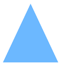

# Luku 9 — Oman sijainnin asettaminen

Karttasymbolisi sijoittuu sinne, missä kerrot järjestelmälle olevasi. Jos
et aseta sijaintia, symbolisi jää tilisi oletussijaintiin (tai kartan
alkupisteeseen), kunnes teet sen.

## Sijaintisi asettaminen

1. Napsauta tilapalkin **Sijainti**-nappia.
2. Pieni valikko avautuu kahdella vaihtoehdolla:

### Vaihtoehto A — Valitse kartalta

- Napsauta **Napsauta kartalta**.
- Nappi vaihtuu tekstiin *Peruuta sijainnin valinta* osoittamaan, että
  valinta on käynnissä.
- Napsauta mitä tahansa kohtaa kartalla — zoomaa ensin lähelle todellista
  sijaintiasi, jotta napsautus osuu tarkasti.

### Vaihtoehto B — Käytä laitteen paikannusta

- Napsauta **Käytä selaimen paikannusta**.
- Selaimesi kysyy lupaa jakaa sijaintisi; anna lupa.
- Laite määrittää sijaintinsa (tarkinta GPS:llä varustetuilla laitteilla).

## Asettamisen jälkeen

- **Sininen kolomiarkeri** ilmestyy sijaintisi kohdalle kartalle:

  

- Koordinaattisi näkyvät **Sijainti**-napin vieressä, joten voit lukea ne
  milloin tahansa.
- Muut käyttäjät näkevät symbolisi siirtyvän uuteen sijaintiin hetkessä.

Sijainti muistetaan tällä laitteella ja otetaan automaattisesti uudelleen
käyttöön seuraavalla kirjautumiskerralla.

## Muuttaminen tai korjaaminen

Aseta se vain uudelleen — valitse kartalta saadaksesi tarkkuuden tai
käytä selaimen paikannusta liikuttuasi.

## Yksityisyysmuistutus

Sijaintisi on jaettu kaikkien TAK-verkkosi käyttäjien kesken — se on sen
tarkoitus. Aseta se harkiten: jos toimit toimistosta, kun kutsimerkkisi
edustaa maastossa toimivaa joukkuetta, aseta symbolisi sinne missä
joukkue on, ei sinne missä tietokoneesi on.
